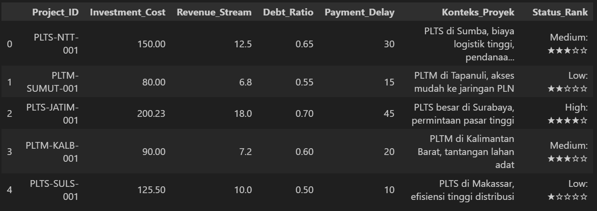
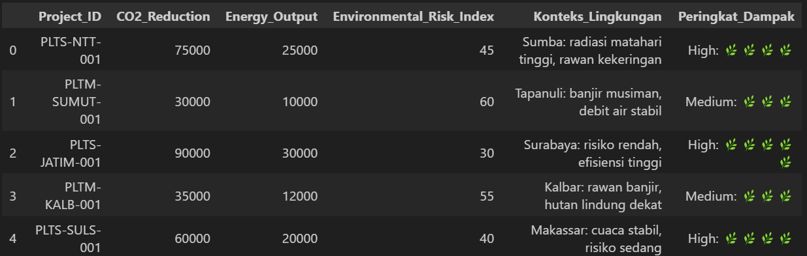
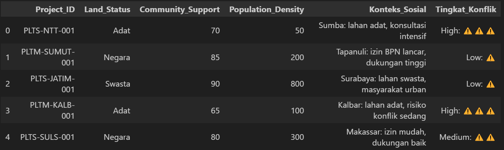
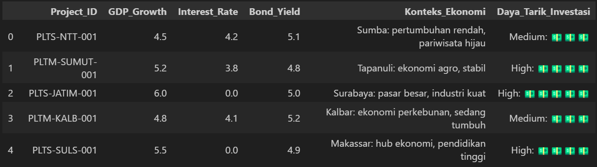
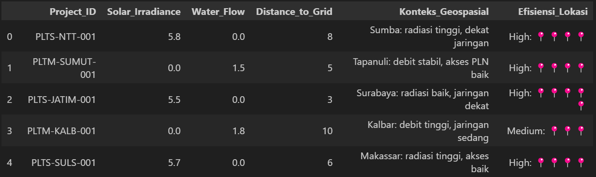

# Green-Finance-Analysis
## Latar Belakang
Perubahan iklim dan degradasi lingkungan hidup telah menjadi tantangan global yang menuntut respons konkret dari berbagai sektor, termasuk sektor keuangan. Dalam upaya menciptakan pertumbuhan ekonomi yang berkelanjutan, konsep green finance atau pembiayaan hijau hadir sebagai pendekatan strategis untuk mendorong investasi yang ramah lingkungan dan berkelanjutan.

Green finance mencakup segala bentuk pembiayaan yang memperhatikan aspek lingkungan, baik melalui investasi pada proyek-proyek energi terbarukan, efisiensi energi, pengelolaan limbah, maupun konservasi sumber daya alam. Pendekatan ini tidak hanya berorientasi pada keuntungan finansial semata, tetapi juga mempertimbangkan dampak sosial dan ekologis dari kegiatan ekonomi.

Pada project kali ini, kami mencoba melakukan pendekatan pada 5 aspek, yaitu : 
1. Financial - mengukur kesehatan keuangan dan kelayakan suatu proyek hijau dari perspektif investasi dan risiko,
2. Enviromental - mengukur dampak langsung proyek terhadap lingkungan, menjadi inti dari klaim "hijau",
3. Social - mengukur dampak proyek terhadap masyarakat, aspek krusial dalam kerangka ESG (*Environmental, Social, and Governance*), 
4. Economic - menyediakan konteks kondisi ekonomi di mana proyek beroperasi, yang dapat memengaruhi kinerja dan risikonya. Data ini digunakan sebagai variabel kontrol atau prediktor dalam model risiko makro, 
5. dan Geospatial - memberikan informasi berbasis lokasi yang krusial untuk memahami risiko dan dampak lingkungan spesifik terkait lokasi proyek.

## 1. Financial
### Variabel kunci :
<li> <strong>Investment_Amount </strong><br>jumlah total dana yang diinvestasikan dalam proyek (dalam rupiah). Semakin banyak jumlah nya, harapannya akan lebih besar kontribusi dan potensi nya.
<li> <strong>Loan_Interest_Rate</strong><br>Suku bunga pinjaman (dalam persen per tahun). Semakin rendah suku bunga, dapat diindikasikan bahwa proyek berisiko rendah, atau ada indikasi adanya insentif keuangan hijau.
<li> <strong>Default_Risk_Score</strong><br>skor prediksi kemungkinan gagal bayar (skala 0-100, dengan 100 menunjukkan risiko tertinggi). Sebagai penilaian kelayakan pembiayaan.
<li> <strong>Green_Bond_Spread</strong><br>selisih imbal hasil (dalam basis poin) antara obligasi hijau dan obligasi konvensional dengan profil risiko serupa. Nilai negatif menunjukkan "greenium", yaitu preferensi investor untuk aset hijau.

### Formula
```math
GNPV = NΣₜ (CFₜ + Eₜ) / (1 + r)ᵗ - I₀
```
Penjelasan
<ul>
<li> GNPV : Green Net Present Value, nilai sekarang bersih dari proyek dengan mempertimbangkan dampah lingkungan (dalam rupiah)
<li> CFₜ : arus kas konvensional pada periode t (dalam rupiah), yang mencakup pendapatan operasional dikurangi biaya operasional dan pajak
<li> Eₜ : Nilai moneter dari eksternalitas lingkungan pada periode t (dalam rupiah)
<li> r : Tingkat diskonto (dalam desimal, misalnya 0.05 untuk 5%), yang mencerminkan biaya modal atau risiko proyek
<li> t : periode waktu (dalam tahun)
<li> N : umur proyek (dalam tahun)
<li> I₀ : Investasi awal (dalam rupiah), merupakan variabel kunci <strong>Investment_Amount </strong>
</ul>

Rules of thumb 
<ul>
<li> proyek dengan GNPV > 0 dianggap layak secara finansial
<li> Semakin tinggi nilai GNPV, semakin baik potensi proyek tersebut
</ul>

### Dataset
🔹Data yang digunakan yaitu : [Financial_Dataset](dataset/Financial_Dataset.xlsx)  
🔹Berisikan kolom Project_ID, Investment_Cost, Revenue_Stream, Debt_Ratio, Payment_Delay, Konteks_Proyek, dan Status_Rank


### Perhitungan
Dari data tersebut, kita bisa mencari GNPV dengan menentukan:
1. CFₜ : kolom Revenue_Stream
2. Eₜ : karena ini merupakan data proyek PLTS, maka ada potensi pengurangan emisi CO2 yang dihargai sebagai Rₜ + Pc, dimana Rₜ bisa didapat pada kolom Energy_Output pada Environmental_Dataset (ada dibagian 2, setelah ini), dan Pc adalah 96000[^1]
<!-- 2. Eₜ : karena ini merupakan data proyek PLTS, maka ada potensi pengurangan emisi CO2, cara mencari nya yaitu menggunakan harga karbon (Rp 96 per kg)[^1] dibagi dengan harga listrik per KWh[^2] (karena dari PLTS bisa menghemat 2,23 pon ~ 1kg CO2 per KWh)[^3], sehingga didapat `((96000/1000) /1444)*100%`  maka `Eₜ = 6,6%` dari total revenue -->
3. r : 5,5% [^2] (dapat disesuaikan menggunakan ERAF pada bagian keempat, Economic)
4. N : 25 [^3]
5. I₀ : kolom Investment_Cost

dari komponen yang telah didapat, selanjutnya GNPV bisa dihitung.

---
[^1]: [harga karbon](https://www.tempo.co/ekonomi/ri-resmi-luncurkan-perdagangan-karbon-internasional-harga-rp-96-ribu-dan-rp-144-ribu-per-ton-1196430)  
[^2]: [Suku Bunga](https://id.tradingeconomics.com/indonesia/interest-rate)  
[^3]: [masa pakai PLTS](https://lestari.kompas.com/read/2023/06/17/170000686/berapa-lama-masa-pakai-plts-)
<!-- [^2] : [harga listrik 2025](https://money.kompas.com/read/2025/06/20/101721226/rincian-tarif-listrik-per-20-juni-2025-untuk-semua-golongan-pelanggan)  
[^3] : [konversi pengurangan emisi dari PLTS](https://www.hmenergi.com/jejak-karbon-panel-surya-tidak-lebih-buruk-dari-batu-bara/#:~:text=1%20Panel%20surya%20menghasilkan%200%20gram%20per%20kWh,batu%20bara%20menghasilkan%202%2C23%20pon%20CO2%20per%20kWh)   -->

---
## 2. Environmental
### Variabel kunci :
<li> <strong>CO2_Emissions_Reduction </strong><br>
Pengurangan emisi CO2 atau ekuivalennya (dalam ton CO2e/tahun). Metrik utama untuk dampak iklim
<li> <strong>Renewable_Energy_Share</strong><br>Persentase energi dari sumber terbarukan (dalam persen). Mengukur kontribusi terhadap transisi energi
<li> <strong>Water_Savings</strong><br>Volume penghematan air (dalam m3/tahun). Penting untuk proyek di wilayah rawan kekeringan
<li> <strong>Biodiversity_Impact_Score</strong><br>Skor dampak terhadap keanekaragaman hayati (skala -100 hingga 100, dengan positif menunjukkan restorasi dan negatif menunjukkan kerusakan)

### Formula
```math
CROI = NΣₜ (Rₜ + Pc) / I₀
```

Penjelasan
<ul>
<li>CROI : Carbon Return on Investment, rasio yang menunjukkan pengembalian karbon per unit investasi (tanpa satuan)
<li> Rₜ : Pengurangan emisi tahunan pada periode t (dalam ton CO2e), merupakan variabel kunci <strong>CO2_Emissions_Reduction</strong>
<li> Pc : Nilai moneter dari eksternalitas lingkungan pada periode t (dalam rupiah)
<li> I₀ : Investasi awal (dalam rupiah)
</ul>

Rules of thumb 
<ul>
<li> proyek dengan CROI > 1 menghasilkan nilai pengurangan karbon lebih besar daripada biayanya
<li> Semakin tinggi nilai CROI, semakin diprioritaskan untuk investasi iklim
</ul>

### Dataset
🔹Data yang digunakan yaitu : [Environmental_Dataset](dataset/Environmental_Dataset.xlsx)  
🔹Berisikan kolom Project_ID, CO2_Reduction, Energy_Output, Environmental_Risk_Index, Konteks_Lingkungan, dan Peringkat_Dampak


### Perhitungan
Dari data tersebut, kita bisa mencari CROI dengan menentukan:
1. Rₜ : kolom CO2_Reduction
2. Pc : 96000 [^1]
3. N : 25 [^2]
4. I₀ : kolom Investment_Cost pada Financial_Dataset di bagian sebelumnya
  
dari komponen yang telah didapat, selanjutnya CROI bisa dihitung.

---
[^1]: [harga karbon](https://www.tempo.co/ekonomi/ri-resmi-luncurkan-perdagangan-karbon-internasional-harga-rp-96-ribu-dan-rp-144-ribu-per-ton-1196430)  
[^2]: [masa pakai PLTS](https://lestari.kompas.com/read/2023/06/17/170000686/berapa-lama-masa-pakai-plts-)

---
## 3. Social
### Variabel kunci :
<li> <strong>Jobs_Created </strong> <br> Jumlah lapangan kerja penuh waktu (Full-Time Equivalent, FTE) yang diciptakan. mencerminkan kontribusi terhadap ekonomi lokal
<li> <strong>Community_Engagement_Score</strong><br>Skor keterlibatan masyarakat (skala 0-100). mengukur penerimaan sosial atau "lisensi sosial untuk beroperasi"
<li> <strong>Access_to_Clean_Energy_Rate</strong><br>Persentase peningkatan akses energi bersih, terutama di daerah 3T (Terdepan, Terluar, Tertinggal)
<li> <strong>Gini_Coefficient_Impact</strong><br>Dampak terhadap ketimpangan pendapatan (nilai negatif menunjukkan pengurangan ketimpangan, positif menunjukkan peningkatan ketimpangan)

### Formula
```math
SROI = NΣₜ (NVsocial) / I₀
```

Penjelasan
<ul>
<li>SROI : Social Return on Investment, rasio yang menunjukkan nilai sosial per unit investasi (tanpa satuan)
<li> NVsocial : Nilai sekarang (*Net Present Value*) dari dampak sosial yang dimonetisasi (dalam rupiah). Contohnya, nilai ekonomi dari <strong>Jobs_Created</strong> yang dihitung sebagai jumlah pekerjaan × upah rata-rata tahunan, atau penghematan biaya kesehatan dari <strong>Access_to_Clean_Energy_Rate</strong>
<li> I₀ : Investasi awal (dalam rupiah)
</ul>

Rules of thumb 
<ul>
<li> proyek dengan SROI > 1  menunjukkan proyek menciptakan nilai sosial lebih besar daripada biayanya
<li> SROI digunakan untuk membandingkan proyek sosial
</ul>

### Dataset
🔹Data yang digunakan yaitu : [Social_Dataset](dataset/Social_Dataset.xlsx)  
🔹Berisikan kolom Project_ID, Land_Status, Community_Support, Population_Density, Konteks_Sosial, dan Tingkat_Konflik


### Perhitungan
Dari data tersebut, kita bisa mencari SROI dengan menentukan:
1. NVsocial : 
3. N : 25 [^1]
4. I₀ : kolom Investment_Cost pada Financial_Dataset di bagian sebelumnya

dari komponen yang telah didapat, selanjutnya SROI bisa dihitung.

---
[^1]: [masa pakai PLTS](https://lestari.kompas.com/read/2023/06/17/170000686/berapa-lama-masa-pakai-plts-)

---
## 4. Economic
### Variabel kunci :
<li> <strong>GDP_Growth </strong> <br>Pertumbuhan Produk Domestik Bruto (dalam persen per tahun). Pertumbuhan tinggi mendukung permintaan energi dan proyek terbarukan
<li> <strong>Inflation_Rate</strong><br>Tingkat inflasi (dalam persen per tahun). Inflasi tinggi meningkatkan biaya proyek dan menekan margin keuntungan
<li> <strong>FDI_Inflows</strong><br>Arus masuk Penanaman Modal Asing (dalam miliar USD). Indikator kepercayaan investor terhadap iklim investasi nasional
<li> <strong>Unemployment_Rate</strong><br>Tingkat pengangguran (dalam persen). Proyek di daerah dengan pengangguran tinggi memiliki dampak sosial lebih besar

### Formula
```math
ERAF = 1 + w₁*((Ir - Ir,base)/Ir,base) + w₂*((Ur - Ur,base)/Ur,base) − w₃*((Gg -Gg,base)/Gg,base)
```

Penjelasan
<ul>
<li>ERAF : Economic Risk Adjustment Factor, faktor penyesuaian risiko ekonomi (tanpa satuan)
<li> Ir : Tingkat inflasi saat ini (dalam persen)
<li> Ir,base : Tingkat inflasi dasar (misalnya, rata-rata historis atau target bank sentral)
<li> Ur : Tingkat pengangguran saat ini (dalam persen)
<li> Ur,base : Tingkat pengangguran dasar (misalnya, rata-rata historis)
<li> Gg : Pertumbuhan PDB saat ini (dalam persen)
<li> Gg,base : Pertumbuhan PDB dasar (misalnya, rata-rata historis)
<li> w₁,w₂,w₃ : Bobot relatif (dengan w₁+w₂+w₃=1), ditentukan berdasarkan sensitivitas proyek terhadap faktor ekonomi
</ul>

Rules of thumb 
<ul>
<li> proyek dengan ERAF > 1 meningkatkan risiko, sedangkan ERAF < 1 menurunkannya
<li> Gunakan ERAF untuk menyesuaikan tingkat diskonto dalam GNPV (lihat ke bagian pertama,  Financial)
</ul>

### Dataset
🔹Data yang digunakan yaitu : [Economic_Dataset](dataset/Economic_Dataset.xlsx)  
🔹Berisikan kolom Project_ID, GDP_Growth, Interest_Rate, Bond_Yield, Konteks_Ekonomi, dan Daya_Tarik_Investasi


### Perhitungan
Dari data tersebut, kita bisa mencari ERAF dengan menentukan:
1. Ir : kolom Interest_Rate
2. Ir,base : 5,75% [^1]
3. Ur : 
4. Ur,base :
5. Gg : kolom GDP_Growth
6. Gg,base :
7. w₁,w₂,w₃ :

dari komponen yang telah didapat, selanjutnya ERAF bisa dihitung.

---
[^1]: [BI Rate](https://www.bi.go.id/id/publikasi/ruang-media/news-release/Pages/sp_278425.aspx#:~:text=BI%2DRate%20Tetap%205%2C75,Mempertahankan%20Stabilitas%2C%20Mendukung%20Pertumbuhan%20Ekonomi)  

---

## 5. Geospatial
### Variabel kunci :
<li> <strong>Latitude/Longitude </strong><br>Koordinat geografis (dalam derajat). Digunakan untuk pemetaan risiko bencana seperti banjir, gempa, atau longsor.
<li> <strong>Proximity_to_Protected_Area</strong><br> Jarak ke kawasan lindung (dalam kilometer). Jarak dekat meningkatkan risiko regulasi dan reputasi.
<li> <strong>Land_Use_Change</strong> <br>Perubahan tutupan lahan (misalnya, dari hutan ke perkebunan). Indikator utama risiko deforestasi.

### Formula
```math
GRI = w₁*Shazard + w₂*Sproximity + w₃*Slanduse
```

Penjelasan
<ul>
<li>GRI : Geospatial Risk Index, skor risiko geospasial (skala 0-1, dengan 1 menunjukkan risiko tertinggi)
<li> Shazard : Skor normalisasi risiko bencana alam (skala 0-1), berdasarkan data historis atau peta risiko dari BNPB/BMKG
<li> Sproximity : Skor normalisasi risiko kedekatan dengan kawasan lindung (skala 0-1), dihitung dari <strong>Proximity_to_Protected_Area</strong>
<li> Slanduse : Skor normalisasi dampak perubahan tata guna lahan (skala 0-1), berdasarkan tingkat keparahan perubahan (misalnya, deforestasi primer mendapat skor tinggi)
<li> w₁,w₂,w₃ : Bobot relatif untuk setiap faktor risiko (dengan w₁+w₂+w₃=1), ditentukan berdasarkan kebijakan atau analisis seperti Analytical Hierarchy Process (AHP).
</ul>

Rules of thumb 
<ul>
<li> proyek dengan GRI > 0.7 memerlukan uji tuntas tambahan atau mungkin ditolak
<li> Gunakan sumber data spasial resmi seperti Ina-Geoportal atau KLHK untuk akurasi
<li> Verifikasi koordinat (Latitude/Longitude) terhadap Peta Indikatif Penghentian Pemberian Izin Baru (PIPPIB)
</ul>

### Dataset
🔹Data yang digunakan yaitu : [Geospatial_Dataset](dataset/Geospatial_Dataset.xlsx)  
🔹Berisikan kolom Project_ID, Solar_Irradiance, Water_Flow, Distance_to_Grid, Konteks_Geospatial, dan Efisiensi_Lokasi


### Perhitungan
Dari data tersebut, kita bisa mencari GRI dengan menentukan:
1. Shazard : 
2. Sproximity : 
3. Slanduse : 
7. w₁,w₂,w₃ :

dari komponen yang telah didapat, selanjutnya GRI bisa dihitung.

---
